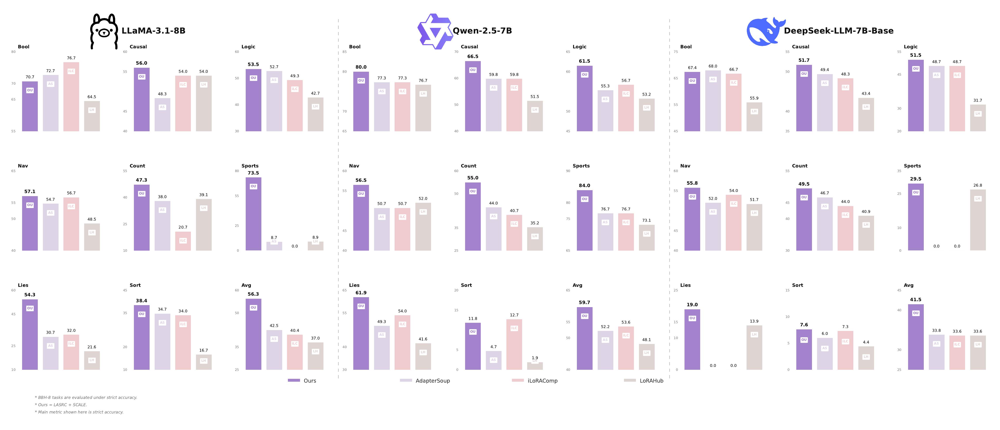

# SCALE-LoRA

> Residual Adapter Composition with Support-Time Candidate Selection in Open LoRA Pools

[Open the original PDF figure](figures/combined_dashboard.pdf)

## English

SCALE-LoRA studies how to compile multiple selected LoRA adapters into one target-conditioned adapter state when only a small support set is available. The project focuses on two components:

- **LASRC**: a layer-adaptive residual composition method that preserves a support-weighted linear anchor and composes block-wise residual directions in adapter-parameter space.
- **SCALE-FG**: a finite-grid support-time selection method that builds a small set of candidate adapter states, scores them on the support examples, and uses the selected state for query evaluation.

In matched FLAN-T5-Large BBH-27 experiments with a fixed 97-LoRA pool, LASRC obtains 36.44 EM and SCALE-FG obtains 36.87 EM. The results support a compile-then-decode view of open-pool LoRA composition.

## 中文

SCALE-LoRA 研究在开放 LoRA 池中，如何利用少量 support examples 将多个已选 LoRA 适配器编译成一个面向目标任务的适配器状态。论文代码和方法介绍聚焦两个部分：

- **LASRC**：一种层自适应残差组合方法，保留 support 加权的线性组合锚点，并在适配器参数空间中进行 block-wise 残差方向组合。
- **SCALE-FG**：一种有限网格的 support-time 选择方法，先构造少量候选适配器状态，再用 support examples 选择一个状态用于 query evaluation。

在固定 97 个 LoRA 的 FLAN-T5-Large BBH-27 匹配实验中，LASRC 达到 36.44 EM，SCALE-FG 达到 36.87 EM。结果表明，将 LoRA 组合视为“先编译适配器状态，再进行解码评估”是一个可控且有效的研究接口。

## Repository

Some running data and logs are provided in the code package under `paper_evidence/`.

部分运行数据和日志放在代码包的 `paper_evidence/` 文件夹中。
